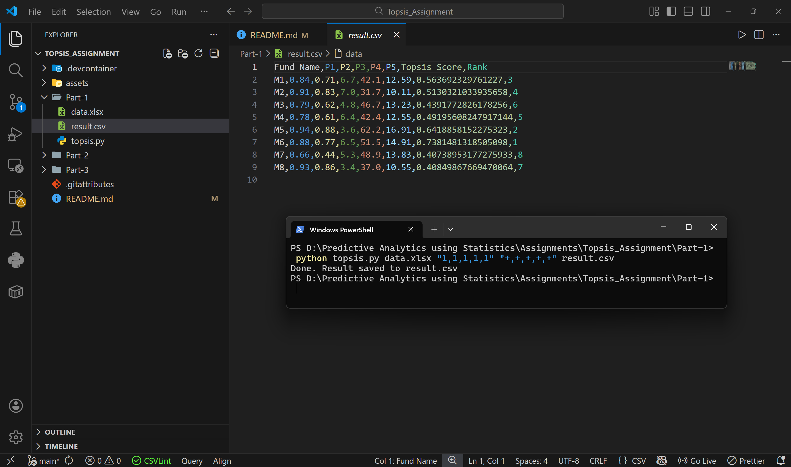
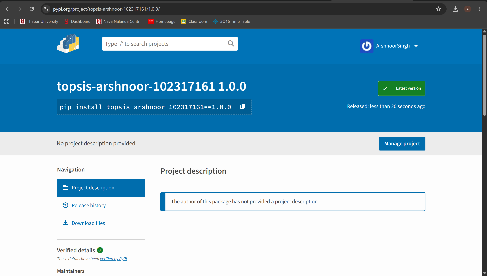
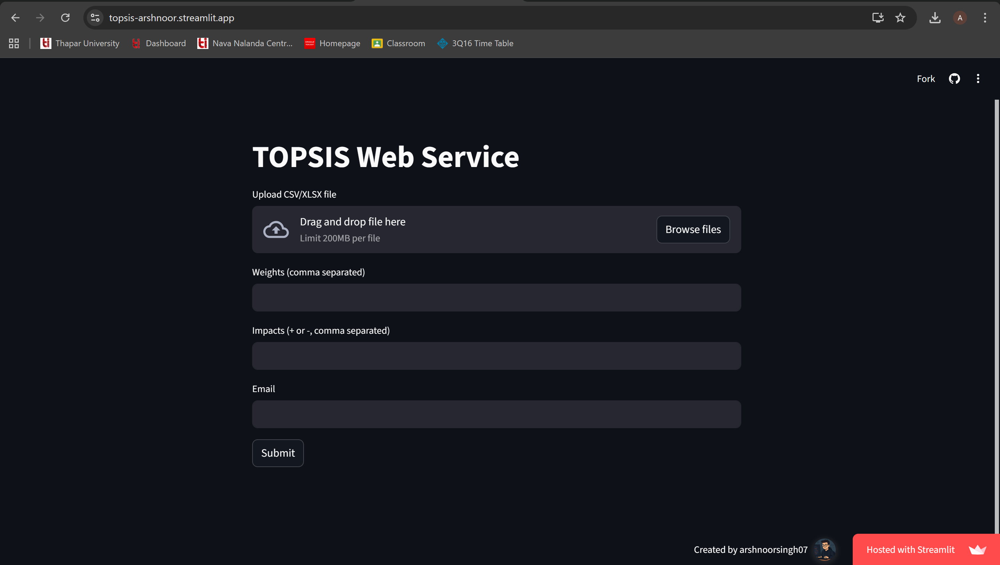
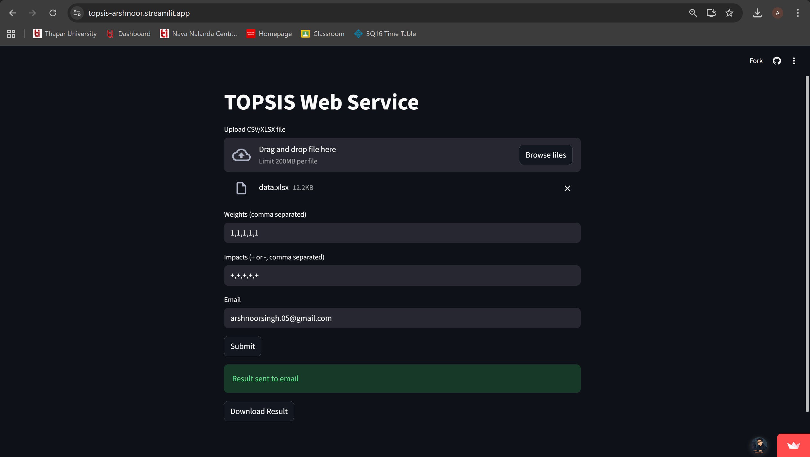
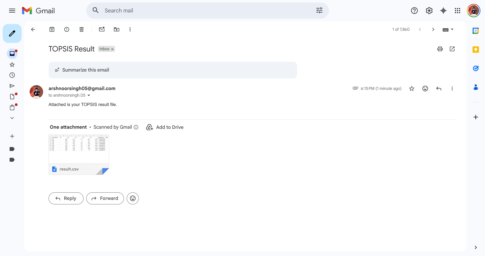

## TOPSIS Decision Making System

**Name:** Arshnoor Singh  
**Roll Number:** 102317161  
**Course:** Predictive Analytics

---

## Live Web App

Streamlit Link:
https://topsis-arshnoor.streamlit.app/

---

## About This Project

This project implements **TOPSIS (Technique for Order Preference by Similarity to Ideal Solution)** in three ways:

1. **Command Line Program (CLI)**
2. **Python Package on PyPI**
3. **Web Application using Streamlit**

TOPSIS is used to **rank alternatives based on multiple criteria**.
Higher score = better alternative.

---

## Folder Structure

```markdown
Topsis_Assignment/
│
├── Part-1 (CLI)/
|
├── Part-2 (PyPI Package)/
|
├── Part-3 (Web Service)/
|
├── assets/
|
└── README.md
```

---

# Part 1 – CLI Program

### Run Command

```bash
python topsis.py data.xlsx "1,1,1,1,1" "+,+,+,+,+" result.csv
```

### Checks Performed

* File must exist
* Minimum 3 columns
* First column = names
* Remaining columns numeric
* Weights = Impacts = Criteria count
* Impacts must be + or −

---

## CLI Screenshots

### CLI Run 


### Output


---

# Part 2 – Python Package (PyPI)

### Package Name

```bash
topsis-arshnoor-102317161
```

### Install

```bash
pip install topsis-arshnoor-102317161
```

### Run Example

```bash
topsis data.xlsx "1,1,1,1,1" "+,+,+,+,+" result.csv
```

---

## PyPI Screenshot



---

# Part 3 – Web Application (Streamlit)

### Live Link

https://topsis-arshnoor.streamlit.app/

### Features

* Upload CSV or Excel
* Enter weights & impacts
* Enter email
* Result sent to email
* Download result
* Input validation

---

## Web App Screenshots

### Home Page



### After Submit



### Email Received



---

# Methodology

TOPSIS follows these steps:

1. Normalize decision matrix
2. Multiply by weights
3. Identify ideal best & worst
4. Compute distance from both
5. Calculate score
6. Rank alternatives

Higher TOPSIS score → better option.

---

# Result Table

| Fund Name | P1 | P2 | P3 | P4 | P5 | Topsis Score | Rank |
|-----------|----|----|----|----|----|-------------|------|
| M1 | 0.84 | 0.71 | 6.7 | 42.1 | 12.59 | 0.5637 | 3 |
| M2 | 0.91 | 0.83 | 7.0 | 31.7 | 10.11 | 0.5130 | 4 |
| M3 | 0.79 | 0.62 | 4.8 | 46.7 | 13.23 | 0.4392 | 6 |
| M4 | 0.78 | 0.61 | 6.4 | 42.4 | 12.55 | 0.4920 | 5 |
| M5 | 0.94 | 0.88 | 3.6 | 62.2 | 16.91 | 0.6419 | 2 |
| M6 | 0.88 | 0.77 | 6.5 | 51.5 | 14.91 | 0.7381 | 1 |
| M7 | 0.66 | 0.44 | 5.3 | 48.9 | 13.83 | 0.4074 | 8 |
| M8 | 0.93 | 0.86 | 3.4 | 37.0 | 10.55 | 0.4085 | 7 |

---

# Technologies Used

* Python
* Pandas
* NumPy
* Streamlit
* PyPI
* GitHub

---

# Run Web App Locally

```bash
pip install streamlit pandas numpy openpyxl
streamlit run app.py
```

---

# Author

**Arshnoor Singh**

---

# License

For academic use only.
